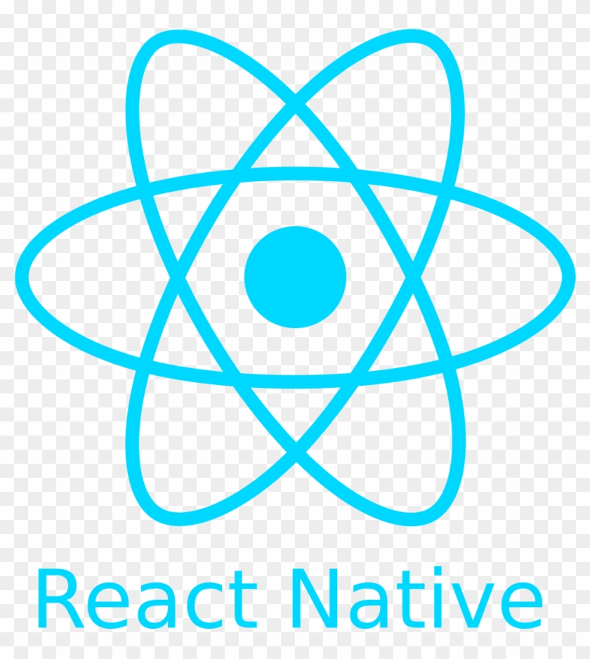
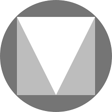

<h1 align="center">
  
  <br>
  React Native Material Design Components
</h1>

React native material design components provides 100% native platform UI components that work on both iOS and Android. All components are followed the official [Material Design Style guide](https://material.io/components/)

# Installation
With npm:
`$ npm install @twentyfive/material-components --save`

With yarn:
`$ yarn add @twentyfive/material-components`

## Android
You need to make your app's theme to inherit `Theme.MaterialComponents`, by changing your app theme in `android/app/src/main/res/values/styles.xml` like following:
```xml
<resources>
    <!-- Base application theme. -->
    <style name="AppTheme" parent="Theme.MaterialComponents.Light.NoActionBar">
        <!-- Customize your theme here. -->
        <item name="android:textColor">#000000</item>
    </style>
</resources>
```
You have some other theme options, you can choose any of them base on your need:
```
Theme.MaterialComponents
Theme.MaterialComponents.NoActionBar
Theme.MaterialComponents.Light
Theme.MaterialComponents.Light.NoActionBar
Theme.MaterialComponents.Light.DarkActionBar
Theme.MaterialComponents.DayNight
Theme.MaterialComponents.DayNight.NoActionBar
Theme.MaterialComponents.DayNight.DarkActionBar
```
## iOS
For iOS, you need to have `cocoapods` installed.

Then run the following command:
```
cd ios && pod install
```
## Usage
```javascript
import { MDButton } from '@twentyfive/material-components';

<MDButton
  style={{ height: 50 }}
  type={'text'} // type can be : text, outline or undefined
  title={"My Button Text1"}
  onPress={this.onBtnClick}
  textColor={'red'}
  textSize={20}
  backgroundColor={'black'}
  elevation={5}
  borderRadius={10}
  borderColor={'blue'}
  borderWidth={10}
  rippleColor={'red'}
  // enabled={false}
/>
```
